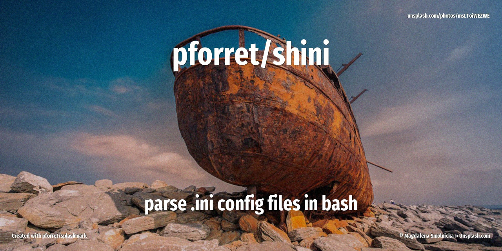

[](https://basher.gitparade.com/package/)

# shini




Bash .ini config file parser

## 🔥 Usage

```
Program: shini 0.0.1 by peter@forret.com
Updated: 2021-08-08
Description: Bash .ini parser
Usage: normal.sh [-h] [-q] [-v] [-f] [-l <log_dir>] [-t <tmp_dir>] <action> <input?>
Flags, options and parameters:
    -h|--help        : [flag] show usage [default: off]
    -q|--quiet       : [flag] no output [default: off]
    -v|--verbose     : [flag] output more [default: off]
    -f|--force       : [flag] do not ask for confirmation (always yes) [default: off]
    -l|--log_dir <?> : [option] folder for log files   [default: /Users/pforret/log/normal]
    -t|--tmp_dir <?> : [option] folder for temp files  [default: .tmp]
    <action>         : [parameter] action to perform: analyze/convert
    <input>          : [parameter] input file/text (optional)
```

## ⚡️ Examples

```bash
> shini .
# start PhpStorm with current folder as project
```

## 🚀 Installation

with [basher](https://github.com/basherpm/basher)

	$ basher install pforret/shini

or with `git`

	$ git clone https://github.com/pforret/shini.git
	$ cd shini

## 📝 Acknowledgements

* script created with [bashew](https://github.com/pforret/bashew)

&copy; 2021 Peter Forret
